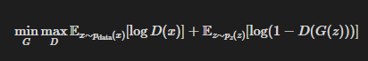
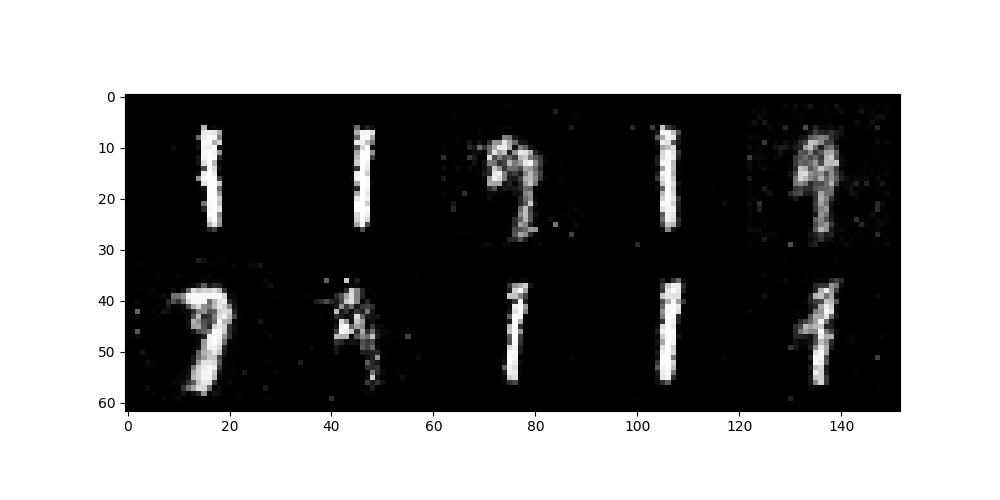

# GANs Image Generation

This project implements Generative Adversarial Networks (GANs) for image generation using PyTorch.

## Mathematical Theory

The GAN framework consists of two neural networks, a Generator $(G)$ and a Discriminator $(D)$, that are trained simultaneously. The Generator tries to create realistic images from random noise, while the Discriminator tries to distinguish between real and generated images.

The objective function for the GAN can be expressed as a minimax game:

<div align="center" class="equation">
   
</div>

Where:

- $G$: The Generator network
- $D$: The Discriminator network
- $x$: A real image sampled from the data distribution $p_{\text{data}}(x)$
- $z$: A random noise vector sampled from a prior distribution $p_z(z)$
- $D(x)$: The probability that $x$ is a real image (output of the Discriminator)
- $G(z)$: The generated image from the random noise $z$
- $D(G(z))$: The probability that the generated image $G(z)$ is real (output of the Discriminator)

## Project Structure

```
├── main.py               # Entry point for the application
├── pyproject.toml        # Project configuration and dependencies
├── README.md             # Project documentation
├── src/                  # Source code for the project
│   ├── config/           # Configuration file for the project
│   ├── data/             # Data loading and preprocessing utilities
│   ├── model/            # GAN model components (Generator and Discriminator)
│   ├── train/            # Training loop and related utilities
│   └── utils/            # Helper functions and utilities
├── assets/               # Generated images and other assets
├── checkpoints/          # Directory for saving model checkpoints
├── logs/                 # Directory for TensorBoard logs
```

## Requirements

- loguru >= 0.7.3
- matplotlib >= 3.10.1
- tensorboard >= 2.19.0
- torch >= 2.6.0
- torchvision >= 0.21.0
- typer >= 0.15.2

## Usage

1. Install dependencies using `uv`:

   ```bash
   uv sync
   ```

2. Run the training script:

   ```bash
   uv run src/train/__init__.py
   ```

   Checkpoints will be saved in the `checkpoints` directory.

3. Visualize the training metrics:

   ```bash
   tensorboard --logdir=logs
   ```

4. To vizualize the generated images, run:

   ```bash
   uv run .\main.py <path_to_checkpoint>
   ```

## Results

After training the GAN for 10 epochs, the following images were generated, showcasing the model's ability to create realistic outputs from random noise:



## License

This project is licensed under the MIT License. See the [LICENSE](LICENSE) file for details.

## References

- [4 Best PyTorch Projects for Beginners](https://medium.com/@amit25173/4-best-pytorch-projects-for-beginners-b88049a44fa2)

- [Generative Adversarial Networks (GANs)](https://arxiv.org/abs/1406.2661)

- [GANs in PyTorch](https://pytorch.org/tutorials/beginner/dcgan_faces_tutorial.html)
